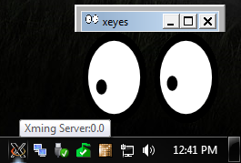

# X11 Forwarding over SSH
* Check that `X11Forwarding yes` is specified on the server in `/etc/ssh/sshd_config`.
* On Windows clients, have an X11 server running like [Xming](http://www.straightrunning.com/XmingNotes/).
* If using `ssh` use the `-X` flag when connecting from the client, e.g. `ssh -X user@host`.
* If using PuTTY check the `Enable X11 forwarding` box under Connection -> SSH -> X11.

https://unix.stackexchange.com/questions/12755/how-to-forward-x-over-ssh-to-run-graphics-applications-remotely

## Troubleshooting w/ Git Bash's SSH client and Debian Stretch (9.5)
Setup above worked w/ PuTTY but not Git Bash on Windows! $DISPLAY environment variable was not set and graphical programs would not launch.

Troubleshoot with `ssh -Xv user@host` for verbose mode and look for any errors related to X forwarding.

``` bash
debug1: No xauth program.
Warning: untrusted X11 forwarding setup failed: xauth key data not generated
````

That looks pretty related. The server says it's installed, though...?

``` bash
brandon@edgar:~$ which xauth
/usr/bin/xauth
```

https://ubuntuforums.org/showthread.php?t=1960021 says to set `X11UseLocalHost no` in `/etc/ssh/sshd_config` and then `sudo systemctl restart ssh`. I did those and was still running into issues.

This working from PuTTY indicates the problem is on the client side... Found https://stackoverflow.com/questions/10129267/x-session-in-git-bash-on-windows which indicates I need the `DISPLAY` environment variable set on the client.

Added this to `~/.bashrc` on the client:

``` bash
export DISPLAY=localhost:0.0
```

and ran using `source ~/.bashrc`. SSHed back in using `ssh -Y user@host` (-Y instead of -X) and now it works.

According to https://askubuntu.com/questions/35512/what-is-the-difference-between-ssh-y-trusted-x11-forwarding-and-ssh-x-u the -Y flag is less secure so I'm gonna stick to PuTTY for my X11 forwarding needs on Windows.


